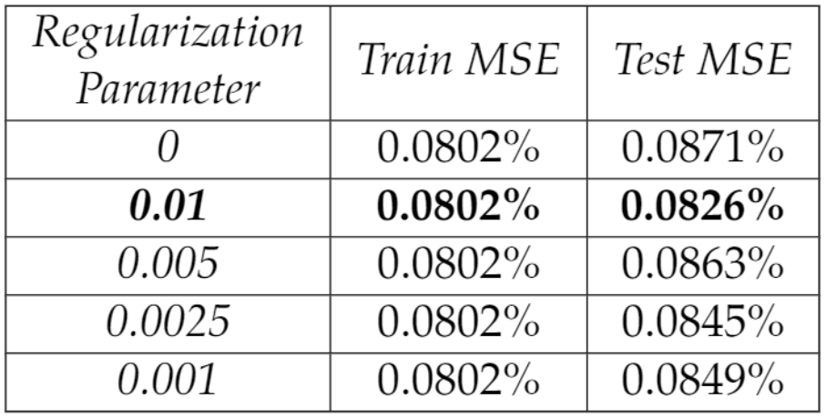
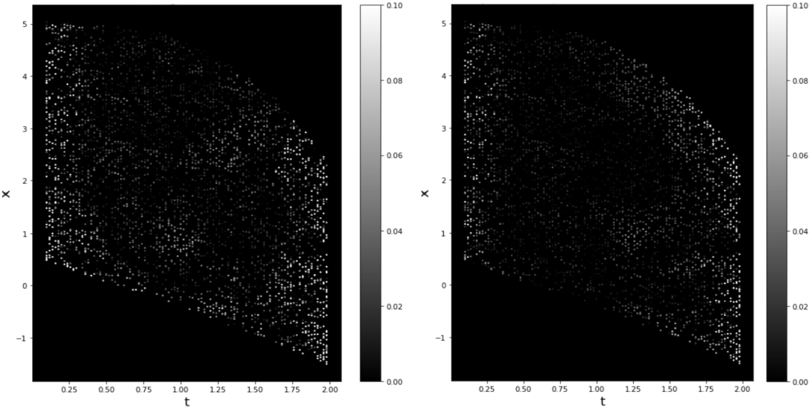

# System Identification with Lipschitz Regularized Neural Networks
The code can be found in the code folder and it can be used to generate comparable results to the ones shown above.

A preprint of this paper with multiple examples and more detailed explanation of the data generation, model and approach can be found here: (https://arxiv.org/abs/2009.03288)
### Problem Statement and Solution Approach
Governing laws for dynamical systems  have traditionally been derived from expert knowledge and first principles, however in recent years the large amount of data available resulted in a growing interest in data-driven approaches for automated model discovery. System identification deals with building mathematical models and approximating the right-hand side  using only observed data from the system.
Frequently used approaches for data-driven discovery of nonlinear differential equations are sparse regression and neural networks. Sparse regression approaches are based on a user-determined library of candidate terms from which the most important ones are selected using sparse regression. Neural networks, especially feed forward and recurrent networks, have been used often for system identification: depending on the architecture and on the loss function, they can be used as sparse regression models or completely determine an unknown differential operator

In this work we investigate the problem of approximating unknown governing equations, i.e. a vector-valued RHS , directly from uniformly time-sampled trajectories using a feed forward neural network . The main contribution of our paper is that we improve generalization and recovery of the governing equation by adding a Lipschitz regularization term in our loss function :

Here  are the network parameters,  are the training data, 0"> and  is the Lipschitz constant of the network. This regularization term forces the Lipschitz constant of the network  to be small, improving the smoothness of the approximating function especially in presence of noise in the data.
We empirically show that the test error on trajectory data, as well as the recovery error on non-trajectory data, improves when using this kind of regularization.

Our method has multiple advantages over other approaches: since neural networks are universal approximators, we can recover very general differential equations, we do not need to commit to a particular dictionary of basis functions, nor need any prior information about the order or about the analytical form of the differential equation, in contrast with sparse regression approaches. Thanks to the Lipschitz regularization term, our network is able to generalize better than non-regularized networks for unseen data and it is robust to noise, in contrast with finite differences and polynomial approximation approaches. Since we use a simple feed forward network, our model runs faster than more complicated recurrent or residual architectures. Since the model is applied component wise, it can handle systems of any dimension, making it usable for real-world data.

### Some Experimental Results
We report here some results obtained when recovering the non-autonomous ODE  with 1% noise in the data.

In the following table we can see that for a fixed training Mean Squared Error (MSE), regularized networks always attain a better test error than the non-regularized one. 

Below we plot the recovery error on test data for the non-regularized network (left figure) and for the best regularized network with parameter 0.01 (right figure). Darker gray level represents lower error. We can see again that the Lipschitz regularized network attains better accuracy on test data than the non regularized one.

